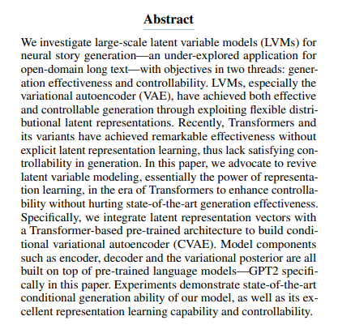

#  Transformer-based Conditional Variational Autoencoder for Controllable Story Generation

## Bengali translate : 

আমরা বড় পরিসরের Latent Variable Models (LVMs) নিয়ে গবেষণা করেছি neural story generation-এর জন্য—যা এখনো খুব একটা গবেষণা হয়নি, বিশেষ করে open-domain দীর্ঘ টেক্সট জেনারেশনে। আমাদের লক্ষ্য দুই দিক থেকে:

জেনারেশনের কার্যকারিতা (effectiveness)

জেনারেশনের উপর নিয়ন্ত্রণ (controllability)।

LVMs (বিশেষ করে Variational Autoencoder – VAE) ইতিমধ্যেই কার্যকর এবং নিয়ন্ত্রিত টেক্সট জেনারেশনে সফল হয়েছে, কারণ এগুলো flexible distributional latent representation ব্যবহার করে।

কিন্তু সাম্প্রতিক সময়ে Transformers এবং এর বিভিন্ন ভ্যারিয়েন্ট অসাধারণ ফলাফল দেখিয়েছে—তবে এখানে explicit latent representation শেখানো হয় না, তাই generation-এ সঠিক controllability পাওয়া যায় না।

এই প্রবন্ধে আমরা প্রস্তাব করছি, Transformer যুগে representation learning (latent variable modeling) আবার ফিরিয়ে আনা উচিত, যাতে controllability বাড়ানো যায়, আবার generation-এর effectiveness কমে না।

এর জন্য আমরা latent representation vectors কে Transformer-based pre-trained architecture-এর সাথে একত্র করেছি এবং একটি Conditional Variational Autoencoder (CVAE) তৈরি করেছি।

এই মডেলের প্রধান অংশগুলো (encoder, decoder, variational posterior) সবই প্রি-ট্রেইন করা GPT-2-এর উপর ভিত্তি করে বানানো হয়েছে।

পরীক্ষার ফলাফল প্রমাণ করেছে যে আমাদের মডেল state-of-the-art conditional generation করতে পারে, এবং একে চমৎকার representation learning এবং controllability ক্ষমতাসম্পন্ন বলা যায়।

## Summary :

এই গবেষণায় বলা হয়েছে যে:

- Transformers ভালো টেক্সট জেনারেশন করতে পারে, কিন্তু controllability কম।

- Variational Autoencoder (VAE)-এর মতো Latent Variable Model controllability ভালোভাবে দিতে পারে।

- তাই গবেষকরা GPT-2 Transformer-এর সাথে VAE মিলিয়ে একটি নতুন CVAE মডেল বানিয়েছেন।

- এই মডেল state-of-the-art টেক্সট জেনারেশন করতে পারে এবং নিয়ন্ত্রণ (controllability) ও representation learning-এ খুব ভালো কাজ করে।