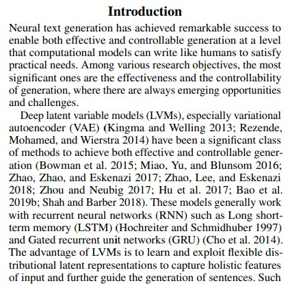
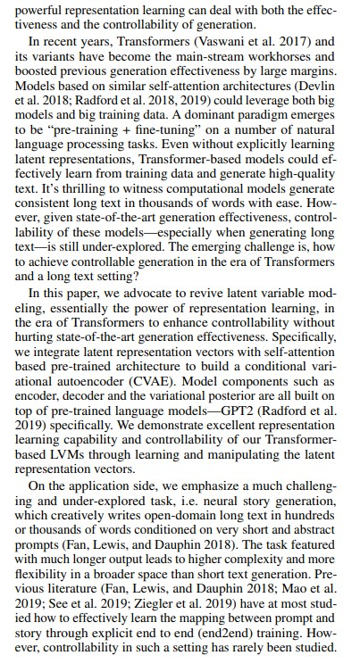
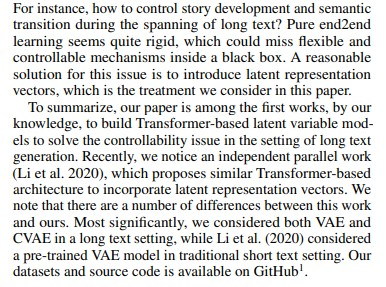

# Introduction

## Translate:

নিউরাল টেক্সট জেনারেশন প্রযুক্তিতে উল্লেখযোগ্য সাফল্য অর্জন করেছে, যা কার্যকরভাবে এবং নিয়ন্ত্রণযোগ্যভাবে গল্প তৈরি করতে পারে। এই প্রযুক্তি বিভিন্ন গবেষণাগত উদ্দেশ্যের মধ্যে সবচেয়ে উল্লেখযোগ্য হলো কার্যকারিতা এবং নিয়ন্ত্রণযোগ্যতা বৃদ্ধি। এই ক্ষেত্রে নতুন সুযোগ ও চ্যালেঞ্জ সবসময় উদ্ভূত হচ্ছে।
গভীর ল্যাটেন্ট ভ্যারিয়েবল মডেল (LVMs), যেমন ওয়েলিং ২০১৩, রেজেন্ডে, মোহামেড, এবং হিয়ারস্ট্রা ২০১৪, এবং অন্যান্য গবেষণায় সীমিত নিয়ন্ত্রণযোগ্যতা সহ কার্যকর পদ্ধতি উন্নত করেছে। এই পদ্ধতি দিয়ে গভীর শেখার মাধ্যমে টেক্সট তৈরি করা যায়।

 

 

## Translate:

সাম্প্রতিক বছরে, ট্রান্সফর্মার (Vaswani et al. 2017) এবং এর ভেরিয়েন্টগুলো প্রধান কাজের মাধ্যম হয়ে উঠেছে এবং এই প্রযুক্তি বড় ডেটা সেটে কাজ করতে পারে। Radford et al. (2018, 2019) এবং Devlin et al. (2018) এর মতো গবেষকরা দেখিয়েছেন যে বড় ভাষার মডেলগুলো "প্রি-ট্রেইনিং + ফাইন-টিউনিং" পদ্ধতিতে কাজ করে। এটি বিভিন্ন ভাষাগত কাজে কার্যকর।
ট্রান্সফর্মার-ভিত্তিক মডেলগুলো উচ্চ-মানের টেক্সট তৈরি করতে পারে, তবে নিয়ন্ত্রণযোগ্যতায় সীমাবদ্ধতা রয়েছে। এই গবেষণায় আমরা ট্রান্সফর্মার-ভিত্তিক LVMs-এর মাধ্যমে নিয়ন্ত্রণযোগ্য টেক্সট তৈরির চ্যালেঞ্জ মোকাবেলা করব।

 

## Translate:

আমাদের গবেষণা ট্রান্সফর্মার-ভিত্তিক LVMs-এর মাধ্যমে নিয়ন্ত্রণযোগ্য টেক্সট তৈরির একটি উদ্ভাবনী পদ্ধতি উপস্থাপন করে। আমরা দেখাবো যে এই মডেলগুলো দীর্ঘ টেক্সট তৈরিতে কার্যকর। Li et al. (2020) এর সাথে আমাদের পদ্দতিতে পার্থক্য রয়েছে। আমাদের কোড ও ডেটা GitHub-এ উপলব্ধ।

# Summary

এই তিনটি ইমেজ একটি গবেষণা কাগজের সূচনা এবং প্রাথমিক অংশের অংশ, যেখানে নিউরাল টেক্সট জেনারেশন (AI-এর মাধ্যমে টেক্সট তৈরি) নিয়ে আলোচনা করা হয়েছে। প্রথমে, এটি বর্ণনা করে যে এই প্রযুক্তি কতটা কার্যকর এবং নিয়ন্ত্রণযোগ্যতা বাড়ানোর চ্যালেঞ্জ রয়েছে। দ্বিতীয় অংশে, ট্রান্সফর্মার মডেল (যেমন Vaswani et al. 2017) এবং LVMs (ল্যাটেন্ট ভ্যারিয়েবল মডেল) ব্যবহারের উপর জোর দেওয়া হয়, যা বড় ডেটা সেটে কাজ করে এবং "প্রি-ট্রেইনিং + ফাইন-টিউনিং" পদ্ধতিতে টেক্সট তৈরি করে। তৃতীয় অংশে, গবেষকরা একটি নতুন পদ্ধতি উপস্থাপন করেন, যা ট্রান্সফর্মার-ভিত্তিক LVMs ব্যবহার করে দীর্ঘ এবং নিয়ন্ত্রিত টেক্সট তৈরি করতে পারে। এটি Li et al. (2020) এর কাজ থেকে আলাদা, এবং তাদের কোড ও ডেটা GitHub-এ শেয়ার করা হয়েছে। সার্বিকভাবে, এই গবেষণা AI-এর মাধ্যমে নিয়ন্ত্রিত গল্প বা টেক্সট তৈরির একটি উন্নত পদ্ধতি তৈরির চেষ্টা করে।
