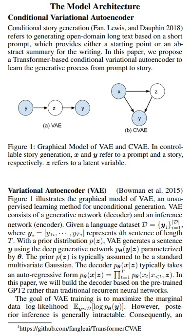
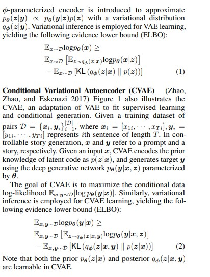
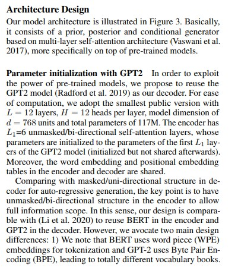
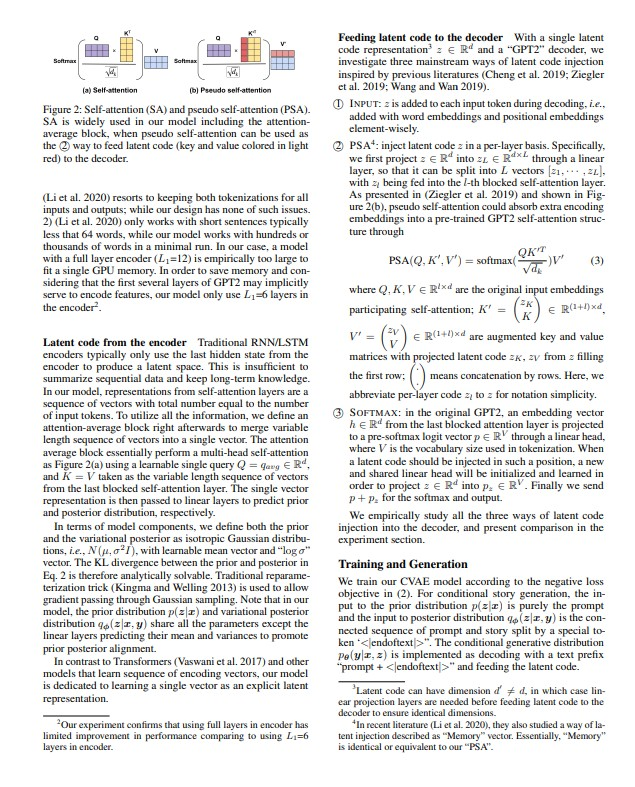
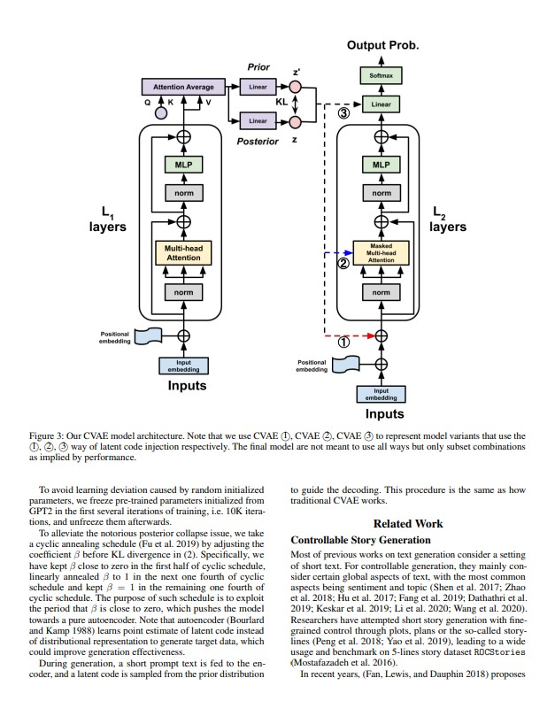

# The Model Architecture

 

## Translate: 

কন্ডিশনাল ভ্যারিয়েশনাল অটোইনকোডার
কন্ডিশনাল স্টোরি জেনারেশন (Fan, Lewis, এবং Dauphin 2018) রেফার করে ওপেন-ডোমেইন লং টেক্সট, যা একটি শর্ট প্রম্পট থেকে শুরু হয়ে তৈরি করা হয়, যা একটি স্টার্টিং পয়েন্ট বা অ্যাবস্ট্রাক্ট সামারি হতে পারে। এই প্রজেক্টে, আমরা একটি ট্রান্সফর্মার-ভিত্তিক কন্ডিশনাল ভ্যারিয়েশনাল অটোইনকোডার প্রস্তাব করছি, যা প্রম্পট থেকে স্টোরি জেনারেট করার প্রক্রিয়া শিখতে পারে।
চিত্র ১: VAE এবং CVAE এর গ্রাফিকাল মডেল
(a) VAE এবং (b) CVAE-এ কন্ট্রোলেবল স্টোরি জেনারেশন, যেখানে $x$ প্রম্পট এবং $y$ স্টোরি, যথাক্রমে গ্রহণযোগ্য। $z$ একটি ল্যাটেন্ট ভ্যারিয়েবল।
ভ্যারিয়েশনাল অটোইনকোডার (VAE) (Bowman et al. 2015)
চিত্র ১ একটি গ্রাফিকাল মডেল দেখায়, যা VAE-এর অশর্তযোগ্য শেখার পদ্ধতি ব্যাখ্যা করে। VAE একটি জেনারেটিভ নেটওয়ার্ক (এনকোডার, ডিকোডার) এবং একটি লিঙ্গুইস্টিক ডেটাসেট $D = \{y_i\}_{i=1}^I$ ব্যবহার করে, যেখানে $y_i = [y_{i,1}, \ldots, y_{i,T}]$ $i$-তম সেন্টেন্সের দৈর্ঘ্য $T$ প্রকাশ করে। এই ডিস্ট্রিবিউশন $p(z)$ VAE দ্বারা সেন্টেন্স জেনারেট করে, যা $\theta$ দ্বারা প্যারামিটারাইজড। প্রায়োগিকভাবে $p(z)$ একটি মাল্টিভারিয়েট গাউসিয়ান। VAE-এর লক্ষ্য হলো ডেটা লগ-লাইকেলিহুড $\mathbb{E}_{y \sim p(y)}[\log p(y)]$ সর্বাধিক করা। তবে, পোস্টেরিয়র ইনফারেন্স সাধারণত অসম্ভব। ফলে, একটি $\phi$-প্যারামিটারাইজড এনকোডার ব্যবহার করে $q_\phi(z|y)$ এর সাথে একটি ভ্যারিয়েশনাল ডিস্ট্রিবিউশন প্রকাশ করা হয়। VAE-এর ইভিডেন্স লোয়ার বাউন্ড (ELBO) হলো:
$$\mathbb{E}_{q_\phi(z|y)}[\log p_\theta(y|z)] - \text{KL}(q_\phi(z|y) || p(z))$$
যেখানে $\text{KL}$ কালকুলাস অফ ভ্যারিয়েশন।
কন্ডিশনাল ভ্যারিয়েশনাল অটোইনকোডার (CVAE) (Zhao, Zhao, এবং Eskenazi 2017)
চিত্র ১ CVAE-এর গ্রাফিকাল মডেল দেখায়। CVAE-এর অ্যাডাপটেশন VAE-এর জন্য একটি সুপারভাইজড লার্নিং ডেটাসেট $D = \{x_i, y_i\}_{i=1}^I$ ব্যবহার করে, যেখানে $x_i = [x_{i,1}, \ldots, x_{i,T_x}]$ প্রম্পট এবং $y_i$ স্টোরি। CVAE-এর লক্ষ্য হলো কন্ডিশনাল ডেটা লগ-লাইকেলিহুড $\mathbb{E}_{x,y \sim p(x,y)}[\log p(y|x)]$ সর্বাধিক করা। এটি একটি $\phi$-প্যারামিটারাইজড এনকোডার ব্যবহার করে $q_\phi(z|x,y)$ এবং $\theta$-প্যারামিটারাইজড ডিকোডার ব্যবহার করে $p_\theta(y|z)$ প্রকাশ করে। CVAE-এর ELBO হলো:
$$\mathbb{E}_{q_\phi(z|x,y)}[\log p_\theta(y|x,z)] - \text{KL}(q_\phi(z|x,y) || p_\theta(z|x))$$
এখানে $\text{KL}$ দুটি ডিস্ট্রিবিউশনের মধ্যে বিচ্যুতি।
লিঙ্ক: https://github.com/fangleai/TransformerCVAE

## Summary ::

- এই ইমেজটি একটি গবেষণা কাগজের "মডেল আর্কিটেকচার" অধ্যায়ের একটি অংশ, যেখানে "কন্ডিশনাল ভ্যারিয়েশনাল অটোইনকোডার" (CVAE) নামে একটি AI মডেলের ব্যাখ্যা দেওয়া হয়েছে। মূল বিষয়গুলো হলো:

- **VAE এবং CVAE-এর পার্থক্য**: VAE একটি অশর্তযোগ্য টেক্সট জেনারেশন মডেল, যেখানে কোনো প্রম্পটের প্রয়োজন নেই। অন্যদিকে, CVAE একটি প্রম্পট ($x$) থেকে নিয়ন্ত্রিত স্টোরি ($y$) তৈরি করে, যেখানে $z$ একটি ল্যাটেন্ট ভ্যারিয়েবল হিসেবে কাজ করে।
- **মডেলের উদ্দেশ্য**: এই গবেষণায় একটি ট্রান্সফর্মার-ভিত্তিক CVAE প্রস্তাব করা হয়েছে, যা শর্ট প্রম্পট থেকে লম্বা টেক্সট বা গল্প জেনারেট করতে পারে।
- **টেকনিক্যাল বিবরণ**: VAE এবং CVAE-এর গ্রাফিকাল মডেল ব্যাখ্যা করা হয়েছে, যেখানে এনকোডার এবং ডিকোডারের মাধ্যমে ডেটা প্রক্রিয়াকরণ এবং ল্যাটেন্ট স্পেস তৈরি করা হয়। VAE-এর লক্ষ্য হলো $\log p(y)$ সর্বাধিক করা, যখন CVAE-এর লক্ষ্য $\log p(y|x)$ সর্বাধিক করা।
- **প্রয়োগ**: এই মডেলটি AI-এর টেক্সট জেনারেশন ক্ষেত্রে নিয়ন্ত্রণযোগ্যতা বাড়াতে ডিজাইন করা, এবং এর কোড GitHub-এ উপলব্ধ।

সর্বমোটে, এই ইমেজটি একটি উন্নত AI মডেলের প্রাথমিক পরিচয় দেয়, যা শর্ট ইনপুট থেকে লম্বা, নিয়ন্ত্রিত গল্প তৈরির জন্য ডিজাইন করা হয়েছে।

 

## Translate: 

কন্ডিশনাল ভ্যারিয়েশনাল অটোইনকোডার (CVAE) (Zhao, Zhao, এবং Eskenazi 2017)
চিত্র ১ CVAE-এর গ্রাফিকাল মডেল দেখায়। CVAE-এর অ্যাডাপটেশন VAE-এর জন্য একটি সুপারভাইজড লার্নিং ডেটাসেট $D = \{x_i, y_i\}_{i=1}^I$ ব্যবহার করে, যেখানে $x_i = [x_{i,1}, \ldots, x_{i,T_x}]$ প্রম্পট এবং $y_i$ স্টোরি। CVAE-এর লক্ষ্য হলো কন্ডিশনাল ডেটা লগ-লাইকেলিহুড $\mathbb{E}_{x,y \sim p(x,y)}[\log p(y|x)]$ সর্বাধিক করা। এটি একটি $\phi$-প্যারামিটারাইজড এনকোডার ব্যবহার করে $q_\phi(z|x,y)$ এবং $\theta$-প্যারামিটারাইজড ডিকোডার ব্যবহার করে $p_\theta(y|z)$ প্রকাশ করে।
একটি $\phi$-প্যারামিটারাইজড এনকোডার প্রকাশ করা হয়েছে $q_\phi(z|y)$ এর সাথে একটি ভ্যারিয়েশনাল ডিস্ট্রিবিউশন, যা VAE-এর জন্য ইভিডেন্স লোয়ার বাউন্ড (ELBO) প্রদান করে:
$$\mathbb{E}_{q_\phi(z|y)}[\log p_\theta(y|z)] - \text{KL}(q_\phi(z|y) || p(z))$$
কন্ডিশনাল ভ্যারিয়েশনাল অটোইনকোডার (CVAE) (Zhao, Zhao, এবং Eskenazi 2017)
চিত্র ১ এটি CVAE-এর গ্রাফিকাল মডেলও দেখায়। CVAE-এর অ্যাডাপটেশন VAE-এর জন্য একটি সুপারভাইজড লার্নিং ডেটাসেট $D = \{x_i, y_i\}_{i=1}^I$ ব্যবহার করে, যেখানে $x_i = [x_{i,1}, \ldots, x_{i,T_x}]$ প্রম্পট এবং $y_i = [y_{i,1}, \ldots, y_{i,T_y}]$ স্টোরি, যথাক্রমে। প্রদত্ত একটি ইনপুট $x$ এর জন্য, CVAE প্রায়োগিকভাবে একটি প্রায়র কোড হিসেবে $p(z|x)$ এনকোড করে, এবং জেনারেট করা স্টোরি $y$ এর জন্য $\theta$-প্যারামিটারাইজড ডিস্ট্রিবিউশন $\mathbb{E}_{q_\phi(z|x,y)}[\log p_\theta(y|x,z)]$।
CVAE-এর লক্ষ্য হলো কন্ডিশনাল ডেটা লগ-লাইকেলিহুড $\mathbb{E}_{x,y \sim p(x,y)}[\log p(y|x)]$ সর্বাধিক করা। এই লক্ষ্য সাধনের জন্য ELBO ব্যবহার করা হয়:
$$\mathbb{E}_{q_\phi(z|x,y)}[\log p_\theta(y|x,z)] - \text{KL}(q_\phi(z|x,y) || p_\theta(z|x))$$
এখানে $\text{KL}$ দুটি ডিস্ট্রিবিউশনের মধ্যে বিচ্যুতি।
নোট করা যায় যে $\phi$-প্যারামিটারাইজড এনকোডার $q_\phi(z|x,y)$ এবং $\theta$-প্যারামিটারাইজড ডিকোডার $p_\theta(z|x)$ CVAE-এ শিখনযোগ্য।

### ফর্মুলা ১: VAE-এর ইভিডেন্স লোয়ার বাউন্ড (ELBO):
  
   $\mathbb{E}_{q_\phi(z|y)}[\log p_\theta(y|z)] - \text{KL}(q_\phi(z|y) || p(z))$

### **ব্যাখ্যা:**

- $\mathbb{E}_{q_\phi(z|y)}[\log p_\theta(y|z)]$: এটি ডিকোডারের মাধ্যমে $\theta$ প্যারামিটার দিয়ে $y$ (আউটপুট টেক্সট) তৈরি করার সম্ভাবনার গড়। এটি মডেলের পুনর্গঠন ক্ষমতা (reconstruction accuracy) নির্দেশ করে।
- $\text{KL}(q_\phi(z|y) || p(z))$: এটি "কুলব্যাক-লেইবলার" বিচ্যুতি, যা এনকোডার দ্বারা তৈরি করা ল্যাটেন্ট ডিস্ট্রিবিউশন $q_\phi(z|y)$ এবং প্রায়র ডিস্ট্রিবিউশন $p(z)$ (সাধারণত গাউসিয়ান) এর মধ্যে পার্থক্য পরিমাপ করে। এটি মডেলকে ল্যাটেন্ট স্পেসে সামঞ্জস্য বজায় রাখতে সাহায্য করে।
- মোট উদ্দেশ্য: VAE এই ELBO-কে সর্বাধিক করার চেষ্টা করে, যা $\log p(y)$ (ডেটার সম্ভাবনা) এর একটি কম নিম্নমান।

### ****উদাহরণ**:
 - ধরো, তুমি একটি সরল বাক্য "গাছটি সবুজ" ($y$) জেনারেট করতে চাও।

 - এনকোডিং: এনকোডার $q_\phi(z|y)$ দিয়ে "গাছটি সবুজ" থেকে একটি ল্যাটেন্ট ভ্যারিয়েবল $z$ তৈরি করে (যেমন, [0.5, -0.2])।
 - ডিকোডিং: ডিকোডার $p_\theta(y|z)$ দিয়ে $z$ থেকে আবার "গাছটি সবুজ" তৈরি করার সম্ভাবনা গণনা করে। ধরো, এটির লগ প্রোবাবিলিটি 0.9।
 - KL বিচ্যুতি: $q_\phi(z|y)$ (যেমন, [0.5, -0.2] এর ডিস্ট্রিবিউশন) এবং $p(z)$ (গাউসিয়ান, যেমন [0, 1]) এর মধ্যে পার্থক্য 0.1।
 - ELBO: $0.9 - 0.1 = 0.8$。 এই মান সর্বাধিক করার চেষ্টা করা হয়, যা মডেলের শুদ্ধতা বাড়ায়।

 ### ফর্মুলা ২: CVAE-এর ইভিডেন্স লোয়ার বাউন্ড (ELBO)
ফর্মুলা:

 $$\mathbb{E}_{q_\phi(z|x,y)}[\log p_\theta(y|x,z)] - \text{KL}(q_\phi(z|x,y) || p_\theta(z|x))$$

### **ব্যাখ্যা:**

- $\mathbb{E}_{q_\phi(z|x,y)}[\log p_\theta(y|x,z)]$: এটি কন্ডিশনাল রিকনস্ট্রাকশন টার্ম, যা $\theta$ প্যারামিটার দিয়ে $y$ (স্টোরি) তৈরি করার সম্ভাবনার গড়, যেখানে $x$ (প্রম্পট) এবং $z$ (ল্যাটেন্ট ভ্যারিয়েবল) বিবেচিত হয়।
- $\text{KL}(q_\phi(z|x,y) || p_\theta(z|x))$: এটি কন্ডিশনাল প্রায়র এবং পোস্টেরিয়র ডিস্ট্রিবিউশনের মধ্যে বিচ্যুতি, যা মডেলকে $x$-এর উপর ভিত্তি করে $z$ এর ডিস্ট্রিবিউশন সামঞ্জস্য করতে সাহায্য করে।
- মোট উদ্দেশ্য: CVAE এই ELBO-কে সর্বাধিক করে $\log p(y|x)$ (প্রম্পট দেওয়া অবস্থায় স্টোরির সম্ভাবনা) উন্নত করতে চায়।

### উদাহরণ:

- ধরো, প্রম্পট $x$ হলো "একটা বাঘ", এবং স্টোরি $y$ হলো "বাঘটি জঙ্গলে ঘুরছে"।

- **এনকোডিং**: এনকোডার $q_\phi(z|x,y)$ দিয়ে "একটা বাঘ" এবং "বাঘটি জঙ্গলে ঘুরছে" থেকে $z$ তৈরি করে (যেমন, [0.7, -0.1])।
- **ডিকোডিং**: ডিকোডার $p_\theta(y|x,z)$ দিয়ে $x$ এবং $z$ থেকে "বাঘটি জঙ্গলে ঘুরছে" তৈরি করার সম্ভাবনা গণনা করে। ধরো, লগ প্রোবাবিলিটি 0.85।
- **KL বিচ্যুতি**: $q_\phi(z|x,y)$ (যেমন, [0.7, -0.1]) এবং $p_\theta(z|x)$ (প্রম্পট-ভিত্তিক গাউসিয়ান) এর মধ্যে পার্থক্য 0.15।
- ELBO: $0.85 - 0.15 = 0.7$。 এই মান সর্বাধিক করা হয়, যা প্রম্পট অনুযায়ী সঠিক স্টোরি তৈরি করতে সাহায্য করে।

# Summary :

- এই ইমেজটি একটি গবেষণা কাগজের "কন্ডিশনাল ভ্যারিয়েশনাল অটোইনকোডার" (CVAE) নামে পরিচিত AI মডেলের বৈশিষ্ট্য ও কার্যপ্রণালী ব্যাখ্যা করে। মূল বিষয়গুলো হলো:

- ****************CVAE-এর কাজ**: CVAE একটি প্রম্পট ($x$) থেকে নিয়ন্ত্রিত স্টোরি ($y$) তৈরি করতে পারে, যেখানে $z$ একটি ল্যাটেন্ট ভ্যারিয়েবল হিসেবে কাজ করে। এটি VAE-এর একটি উন্নত সংস্করণ, যা অশর্তযোগ্য টেক্সট জেনারেশনের জন্য ডিজাইন করা।
- **প্রক্রিয়া**: CVAE একটি সুপারভাইজড ডেটাসেট ব্যবহার করে, যেখানে প্রম্পট এবং স্টোরি জোড়ায় জোড়ায় থাকে। এটি একটি $\phi$-প্যারামিটারাইজড এনকোডার দিয়ে $q_\phi(z|x,y)$ এবং $\theta$-প্যারামিটারাইজড ডিকোডার দিয়ে $p_\theta(y|x,z)$ প্রক্রিয়াকরণ করে।
- **লক্ষ্য**: CVAE-এর মূল লক্ষ্য হলো $\mathbb{E}_{x,y \sim p(x,y)}[\log p(y|x)]$ সর্বাধিক করা, যা কন্ডিশনাল ডেটা লগ-লাইকেলিহুড বাড়ায়। এটি ELBO (ইভিডেন্স লোয়ার বাউন্ড) ব্যবহার করে এই লক্ষ্য অর্জন করে।
- **বৈশিষ্ট্য**: CVAE-এর $\phi$ এবং $\theta$ প্যারামিটার শিখনযোগ্য, যা মডেলকে নমনীয় করে তোলে।

সর্বমোটে, এই ইমেজটি CVAE-এর গড়ন এবং এর কাজের মাধ্যমে AI-এর টেক্সট জেনারেশন ক্ষেত্রে নিয়ন্ত্রণযোগ্যতা যুক্ত করার একটি প্রযুক্তিগত প্রক্রিয়া ব্যাখ্যা করে।

 

## Translate: 

#### আর্কিটেকচার ডিজাইন

আমাদের মডেলের আর্কিটেকচার চিত্র ৩-এ দেখানো হয়েছে। এটি একটি প্রায়োগিক এবং কন্ডিশনাল জেনারেটর ব্যবহার করে, যা Vaswani et al. (2017) এর মাল্টি-লেয়ার সেলফ-অ্যাটেনশন আর্কিটেকচারের উপর ভিত্তি করে।

পরিচালনা: এটি একটি প্রায়র, পোস্টেরিয়র এবং কন্ডিশনাল জেনারেটর নির্মাণ করে, যা বহু-লেয়ার সেলফ-অ্যাটেনশন মডেলে ভিত্তি করে (Vaswani et al. 2017), যা প্রি-ট্রেইনড মডেলের উপর নির্ভরশীল।
পরিচালনার শক্তি: প্রি-ট্রেইনড মডেলগুলোর শক্তি ব্যবহার করে, আমরা GPT2 মডেল (Radford et al. 2019) এর সাথে কাজ করি। এটি ১২ লেয়ার এবং ১৭৭ মিলিয়ন প্যারামিটার ধারণ করে, যার মধ্যে $d = 768$ ইউনিট এবং টোটাল প্যারামিটার ১৭৭ মিলিয়ন। এর মধ্যে $L_1 = 6$ ইউনমাস্কড বাই-ডায়রেকশনাল সেলফ-অ্যাটেনশন লেয়ার রয়েছে, যা GPT2 মডেলের (প্রাথমিকভাবে শেয়ার করা হয়নি) এম্বেডিং টেবিলের সাথে সংযুক্ত।
তুলনা: এই মডেলটি এনকোডার এবং ডিকোডারের মধ্যে শেয়ার করা হয়।
কোডারের জন্য: অটো-রেগ্রেসিভ জেনারেশনের জন্য, কী পয়েন্টটি হলো ফুল-অনমাস্কড/বাই-ডায়রেকশনাল স্ট্রাকচার, যা এনকোডারে ব্যবহৃত হয়।
তথ্য: (Li et al. 2020) সূত্রে, BERT মডেলটি এনকোডারে ব্যবহার করা হয়েছে এবং GPT2-এর মতো ডিকোডারে। এটি দেখায় যে BERT-এর দুটি প্রধান পদ্ধতি (WPE এম্বেডিংস) ব্যবহার করে ডেটা প্রক্রিয়াকরণ করা হয়, যা GPT2-এর ভোকাবুলারি বইয়ের সাথে মিলে যায়।

# Summary :

- এই ইমেজটি একটি গবেষণা কাগজের "আর্কিটেকচার ডিজাইন" অধ্যায়ের অংশ, যেখানে একটি AI মডেলের নকশা ব্যাখ্যা করা হয়েছে, বিশেষ করে ট্রান্সফর্মার-ভিত্তিক প্রি-ট্রেইনড মডেলের ব্যবহার। মূল বিষয়গুলো হলো:

- **মডেলের ভিত্তি**: এটি Vaswani et al. (2017) এর সেলফ-অ্যাটেনশন আর্কিটেকচারের উপর ভিত্তি করে, যা GPT2 (Radford et al. 2019) মডেলের সাথে একত্রিত করা হয়েছে।
- **স্ট্রাকচার**: মডেলটি ১২ লেয়ার এবং ১৭৭ মিলিয়ন প্যারামিটার ধারণ করে, যার ৬টি লেয়ার এনকোডারে এবং ৬টি ডিকোডারে ব্যবহৃত হয়।
- **প্রযুক্তি**: এটি অটো-রেগ্রেসিভ জেনারেশনের জন্য ফুল-অনমাস্কড/বাই-ডায়রেকশনাল স্ট্রাকচার ব্যবহার করে, যা BERT এবং GPT2-এর সমন্বয়ে কাজ করে।
- **লক্ষ্য**: এই নকশা প্রি-ট্রেইনড মডেলের শক্তি ব্যবহার করে টেক্সট জেনারেশনের মান উন্নত করতে চায়।

- সর্বমোটে, এই অংশটি একটি শক্তিশালী AI আর্কিটেকচার তৈরির প্রক্রিয়া ব্যাখ্যা করে, যা ট্রান্সফর্মার এবং প্রি-ট্রেইনড মডেলগুলোর মাধ্যমে ডেটা প্রক্রিয়াকরণ ও টেক্সট তৈরিতে উন্নতি আনে।

 

## Translate: 

পেজটিতে "আর্কিটেকচার ডিজাইন" অধ্যায়ের অংশ রয়েছে। এটি বর্ণনা করে যে কীভাবে প্রি-ট্রেইন্ড GPT2 মডেল ব্যবহার করে একটি CVAE (Conditional Variational Autoencoder) তৈরি করা হয়েছে। মূল ফোকাস ল্যাটেন্ট কোড (একটা গোপন ভ্যারিয়েবল $z$) কে ডিকোডারে ইনজেক্ট (যোগ) করার তিনটি পদ্ধতির উপর। এই পদ্ধতিগুলো হলো:

ইনপুট-ভিত্তিক (Input-based): ল্যাটেন্ট কোডকে ইনপুট এম্বেডিংসের সাথে যোগ করা।
পসিউডো সেলফ-অ্যাটেনশন (Pseudo Self-Attention, PSA): একটা বিশেষ অ্যাটেনশন মেকানিজম দিয়ে কোড যোগ করা।
সফটম্যাক্স-ভিত্তিক (Softmax-based): অ্যাটেনশনের পরে কোড যোগ করা।

এছাড়া, পেজে SA (Self-Attention) এবং PSA-এর চিত্র, ফর্মুলা, এবং ট্রেনিং-জেনারেশন প্রক্রিয়া বর্ণনা করা হয়েছে। এটি দেখায় যে মডেলটি প্রম্পট থেকে কন্ট্রোলড স্টোরি তৈরি করতে পারে, এবং Li et al. (2020) এর কাজের সাথে তুলনা করে।
২. ধাপে ধাপে কনটেন্ট ব্রেকডাউন
পেজটিকে অংশে ভাগ করে অ্যানালাইজ করছি:

## সেলফ-অ্যাটেনশন (SA) এবং পসিউডো সেলফ-অ্যাটেনশন (PSA):

চিত্রের বর্ণনা: দুটি ছোট চিত্র রয়েছে—একটি SA-এর জন্য (কোয়েরি $Q$, কী $K$, ভ্যালু $V$ সহ সফটম্যাক্স) এবং অন্যটি PSA-এর জন্য (কোয়েরি $Q$, কী $K$, ভ্যালু $V$ সহ লাল রঙিন অংশ)। SA হলো স্ট্যান্ডার্ড অ্যাটেনশন, যা টেক্সটের অংশগুলোর মধ্যে সম্পর্ক বোঝে। PSA হলো একটা পরিবর্তিত ভার্সন, যা ল্যাটেন্ট কোডকে অ্যাটেনশনের মধ্যে যোগ করে।
অ্যানালাইসিস: এটি মডেলের কোর মেকানিজম। SA Vaswani et al. (2017) থেকে নেওয়া, যা ট্রান্সফর্মারের ভিত্তি। PSA-এর সুবিধা হলো এটি ল্যাটেন্ট কোডকে আরও ভালোভাবে ইনটিগ্রেট করে, যাতে মডেল প্রম্পটের সাথে মিলিয়ে স্টোরি তৈরি করতে পারে। অসুবিধা: কমপ্লেক্সিটি বাড়ায়, কম্পিউটেশনাল কস্ট বেশি হতে পারে।

## প্রি-ট্রেইন্ড GPT2-এর ব্যবহার:

বর্ণনা: মডেলটি Radford et al. (2019) এর GPT2 ব্যবহার করে, যার ১২ লেয়ার এবং ১৭৭ মিলিয়ন প্যারামিটার। এখানে $L_1 = 6$ লেয়ার এনকোডারে এবং বাকি ডিকোডারে ব্যবহার করা হয়েছে।
অ্যানালাইসিস: প্রি-ট্রেইন্ড মডেল ব্যবহারের সুবিধা হলো এটি ইতিমধ্যে লক্ষ লক্ষ টেক্সট থেকে শিখেছে, তাই নতুন ট্রেনিংয়ে সময় বাঁচে। অসুবিধা: মডেলটি বড়, তাই রান করতে হাই-এন্ড হার্ডওয়্যার লাগে। এটি Li et al. (2020) এর কাজ থেকে ভিন্ন, কারণ তারা পুরো ১২ লেয়ার ব্যবহার করেনি। এই ডিজাইন মডেলকে আরও অপটিমাইজ করে।

## ল্যাটেন্ট কোড থেকে এনকোডার:

বর্ণনা: ঐতিহ্যবাহী RNN/LSTM এর পরিবর্তে সেলফ-অ্যাটেনশন ব্যবহার করে ল্যাটেন্ট স্পেস ($z$) তৈরি করা হয়। এটি ডেটা সংরক্ষণের জন্য গড় গণনা করে।
অ্যানালাইসিস: RNN-এর সমস্যা হলো লং-টার্ম মেমরি ভুলে যাওয়া (vanishing gradient)। সেলফ-অ্যাটেনশন এটি সমাধান করে, যাতে লম্বা টেক্সট (হাজার শব্দ) হ্যান্ডেল করতে পারে। এটি মডেলকে আরও শক্তিশালী করে, কিন্তু ট্রেনিংয়ে সময় লাগে।

ল্যাটেন্ট কোড ইনজেকশনের তিনটি পদ্ধতি:

১. ইনপুট-ভিত্তিক (Input): ল্যাটেন্ট কোডকে ইনপুট এম্বেডিংসের সাথে যোগ করা (যেমন, প্রম্পটের সাথে মিশিয়ে)।

অ্যানালাইসিস: সহজ পদ্ধতি, কিন্তু কোডটি ইগনোর হয়ে যেতে পারে যদি ডিকোডার শক্তিশালী হয়।

২. পসিউডো সেলফ-অ্যাটেনশন (PSA): অ্যাটেনশন লেয়ারে কোড যোগ করা। ফর্মুলা: $ \text{PSA}(Q, K', V') = \text{softmax}\left( \frac{QK'^T}{\sqrt{d_k}} \right) V' $, যেখানে $K'$ এবং $V'$ অগমেন্টেড কী-ভ্যালু।

অ্যানালাইসিস: এটি সবচেয়ে উন্নত, কারণ কোডকে অ্যাটেনশনের মধ্যে ফোর্স করে। সুবিধা: ভালো কন্ট্রোল। অসুবিধা: কমপ্লেক্স ফর্মুলা, ডিবাগ করা কঠিন।

৩. সফটম্যাক্স-ভিত্তিক (Softmax): অ্যাটেনশনের পরে কোড যোগ করা, যেমন প্রজেক্টেড হেড দিয়ে।

অ্যানালাইসিস: মধ্যম পদ্ধতি, যা কোডকে শেষ ধাপে যোগ করে। সুবিধা: সহজ ইমপ্লিমেন্ট। অসুবিধা: কোডের প্রভাব কম হতে পারে।

### ট্রেনিং এবং জেনারেশন:

- **বর্ণনা**: ট্রেনিংয়ে নেগেটিভ লস ব্যবহার করে মডেলকে অপটিমাইজ করা হয়। জেনারেশনে প্রম্পট থেকে স্টোরি তৈরি করা হয়।
- **অ্যানালাইসিস**: এটি CVAE-এর কোর—নেগেটিভ লস (যেমন, পুরোনো ডিস্ট্রিবিউশন) ব্যবহার করে মডেলকে শেখায় কীভাবে ভুল এড়াতে হয়। সুবিধা: ভালো কোয়ালিটির স্টোরি। অসুবিধা: ট্রেনিং ডেটা লাগে প্রচুর।

### ৩. সুবিধা এবং অসুবিধা

সুবিধা:

- মডেলটি প্রি-ট্রেইন্ড GPT2 ব্যবহার করে দ্রুত শেখে।
ল্যাটেন্ট কোড ইনজেকশনের তিনটি পদ্ধতি দিয়ে ফ্লেক্সিবিলিটি বাড়ায়, যাতে স্টোরি কন্ট্রোল করা যায়।
- লম্বা টেক্সট (হাজার শব্দ) হ্যান্ডেল করতে পারে, যা ঐতিহ্যবাহী মডেলে কঠিন।
- প্র্যাকটিক্যাল অ্যাপ্লিকেশন: গল্প লেখা, চ্যাটবট, কনটেন্ট জেনারেশন।

অসুবিধা:

- মডেল বড় (১৭৭ মিলিয়ন প্যারামিটার), তাই রান করতে GPU লাগে।
- PSA-এর মতো পদ্ধতি কমপ্লেক্স, নতুনদের জন্য বোঝা কঠিন।
- ডেটা-ডিপেন্ডেন্ট: ভালো ট্রেনিং ডেটা না থাকলে পারফরম্যান্স খারাপ হতে পারে।
- Li et al. (2020) এর সাথে তুলনায় এটি আরও অপটিমাইজড, কিন্তু পুরো লেয়ার না ব্যবহার করায় কিছু পাওয়ার হারাতে পারে।

৪. সামগ্রিক মূল্যায়ন

এই পেজটি পেপারের টেকনিক্যাল কোর অংশ, যা দেখায় যে গবেষকরা ট্রান্সফর্মার এবং VAE-এর সমন্বয়ে একটা নতুন মডেল তৈরি করেছেন। এটি AI-এর টেক্সট জেনারেশন ফিল্ডে অগ্রগতি, বিশেষ করে কন্ট্রোলেবল স্টোরি তৈরিতে। যদি বাস্তবে ইমপ্লিমেন্ট করা যায়, তাহলে এটি চ্যাটGPT-এর মতো টুলে ব্যবহার করা যেতে পারে। তবে, এটি থিয়োরেটিক্যাল—প্র্যাকটিক্যাল টেস্টিংয়ে আরও উন্নতি লাগতে পারে।
যদি কোনো নির্দিষ্ট অংশে আরও ডিটেল চাও বা ফর্মুলা বুঝতে চাও, বলো! 

 

## Translate: 
